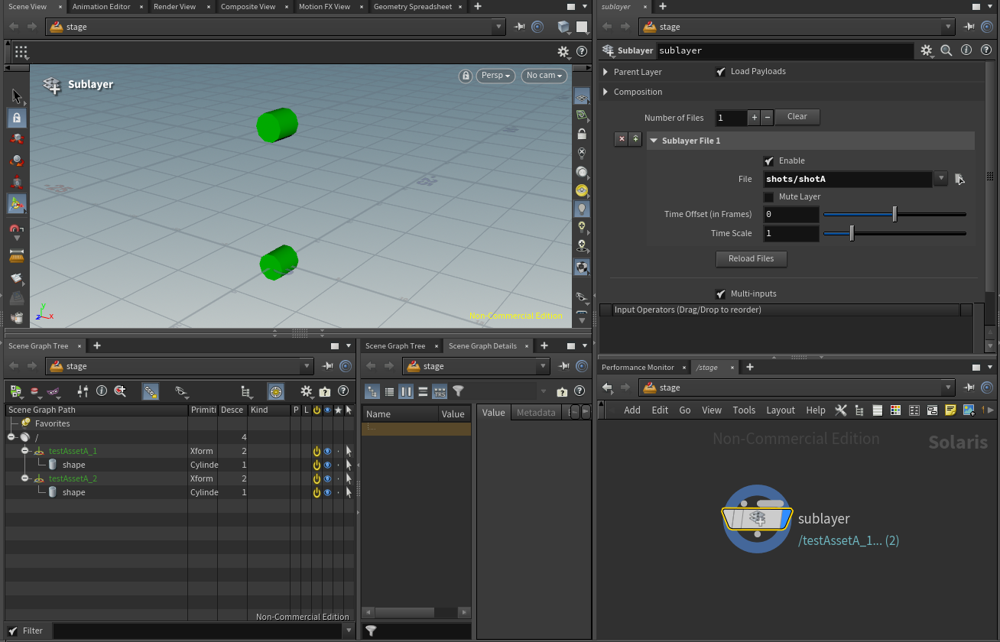
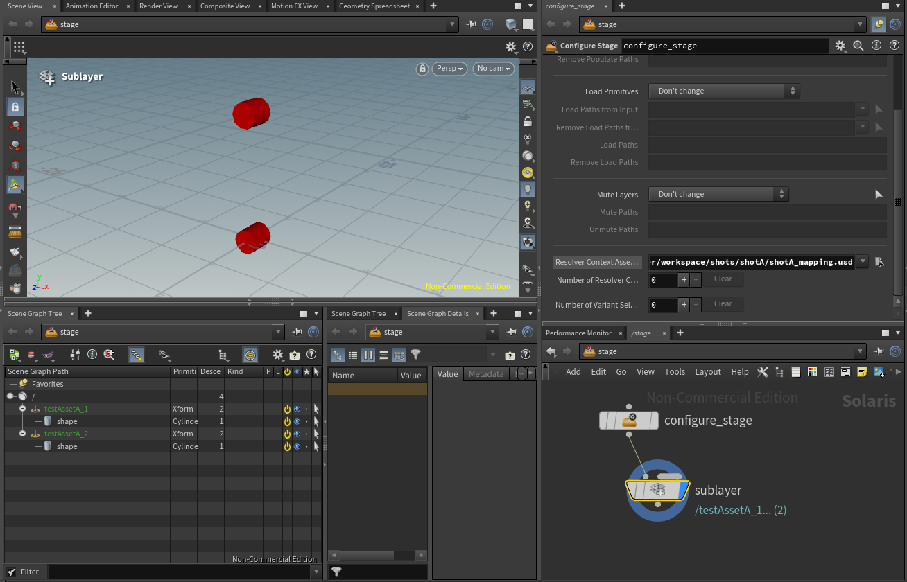

# Production Setup

In this example we examine how a possible production setup would look like.

We enable the advanced feature of exposing relative identifiers to Python by setting the `AR_EXPOSE_RELATIVE_PATH_IDENTIFIERS` environment variable to `1`.

## Prerequisites

To run the example, we must first initialize our environment.

If you are using the pre-compiled builds, make sure that you adjust the paths accordingly.

~~~admonish info title=""
```bash
# Linux
export PYTHONPATH=${REPO_ROOT}/files/implementations/CachedResolver/code:${REPO_ROOT}/dist/${RESOLVER_NAME}/lib/python:${PYTHONPATH}
export PXR_PLUGINPATH_NAME=${REPO_ROOT}/dist/${RESOLVER_NAME}/resources:${PXR_PLUGINPATH_NAME}
export LD_LIBRARY_PATH=${REPO_ROOT}/dist/${RESOLVER_NAME}/lib
export AR_EXPOSE_RELATIVE_PATH_IDENTIFIERS=1
# Windows
set PYTHONPATH=%REPO_ROOT%\files\implementations\CachedResolver\code;%REPO_ROOT%\dist\%RESOLVER_NAME%\lib\python;%PYTHONPATH%
set PXR_PLUGINPATH_NAME=%REPO_ROOT%\dist\%RESOLVER_NAME%\resources;%PXR_PLUGINPATH_NAME%
set PATH=%REPO_ROOT%\dist\%RESOLVER_NAME%\lib;%PATH%
set AR_EXPOSE_RELATIVE_PATH_IDENTIFIERS=1
```
~~~

You'll also need to adjust the `shotA_mapping.usd` to point to absolute file paths:

```python
#usda 1.0
(
    customLayerData = {
        string[] mappingPairs = [
            "assets/assetA", "<Change/This/Path/To/Be/Absolute>/files/implementations/CachedResolver/workspace/assets/assetA/assetA_v002.usd",
            "relativeIdentifier|assets/assetA?surface", "<Change/This/Path/To/Be/Absolute>/files/implementations/CachedResolver/workspace/assets/assetA/elements/surface_v001.usd"
        ]
    }
)
```

## Demo
Let's have a look how we can demo this setup in Houdini.

### Loading our Shot
If everything was initialized correctly, we can sublayer in the shot A USD file by referring to it via `shots/shotA`



Let's inspect what is happening in our `PythonExpose.py`` file:

```python
...
class ResolverContext:

    @staticmethod
    @log_function_args
    def ResolveAndCache(context, assetPath):
        """Return the resolved path for the given assetPath or an empty
        ...
        """
        ...
        resolved_asset_path = ""
        if assetPath.startswith(RELATIVE_PATH_IDENTIFIER_PREFIX):
            ...
        else:
            ####### DOCS
            """ Since our asset identifier doesn't start with our relative path prefix (more on that below),
            the resolve code here is executed. Here we simply map our entity (asset/shot)
            to a specific version, usually the latest one. You'd replace this with a
            database call or something similar. You can also batch call .AddCachingPair
            for multiple paths here (or preferably in the ResolverContext.Initialize method).
            """
            #######
            entity_type, entity_identifier = assetPath.split("/")
            # Here you would add your custom "latest version" query.
            resolved_asset_path = os.path.join(ENTITY_TYPE_TO_DIR_PATH[entity_type],
                                               entity_identifier,
                                               f"{entity_identifier}_v002.usd")
        # Cache result
        context.AddCachingPair(assetPath, resolved_asset_path)
        return resolved_asset_path
...
```

So far so good? Alright, then let's look at some pinning examples.

Different pipelines use different mechanisms of loading specific versions. These two ways are the most common ones:
- Opt-In: A user has to manually opt-in to loading specific/the latest versions
- Opt-Out: The user always gets the latest version, but can optionally opt-out and pin/map specific versions that should not change.

With both methods, we need a pinning mechanism (as well as when we typically submit to a render farm as nothing should change there).

We provide this by either live modifying the context (see the [Python API](./PythonAPI.md) section) or by providing a pinning file.

### Loading Pinning
We can load our pinning via a configure stage node or via the lop network settings, more info on that can be found in the [USD Survival Guide - Asset Resolver](https://lucascheller.github.io/VFX-UsdSurvivalGuide/dcc/houdini/approach.html#compositionAssetResolver) section.



Let's have a look at the content of our pinning file.

```python
#usda 1.0
(
    customLayerData = {
        string[] mappingPairs = [
            "assets/assetA", "<Change/This/Path/To/Be/Absolute>/files/implementations/CachedResolver/workspace/assets/assetA/assetA_v002.usd",
            "relativeIdentifier|assets/assetA?surface", "<Change/This/Path/To/Be/Absolute>/files/implementations/CachedResolver/workspace/assets/assetA/elements/surface_v001.usd"
        ]
    }
)
```

Here we decided to pin/map two things:
- An asset
- An element of an asset

In a production scenario you would pin everything when submitting to the render farm/when saving a scene to keep the state of the scene re-constructable. We decided to not do this here, to showcase the more complicated case of mapping only specific relative paths.

In this case the result is that the v002 of our assetA is being loaded, but with v001 of our surface version and v002 of our model version. Where does the version v002 for our model come from?


When opt-in-ing to expose relative identifiers to Python, the method below gets called.

```python
...
class Resolver:

    @staticmethod
    @log_function_args
    def CreateRelativePathIdentifier(resolver, anchoredAssetPath, assetPath, anchorAssetPath):
        """Returns an identifier for the asset specified by assetPath and anchor asset path.
        ...
        """
        LOG.debug("::: Resolver.CreateRelativePathIdentifier | {} | {} | {}".format(anchoredAssetPath, assetPath, anchorAssetPath))
        # For this example, we assume all identifier are anchored to the shot and asset directories.
        # We remove the version from the identifier, so that our mapping files can target a version-less identifier.
        anchor_path = anchorAssetPath.GetPathString()
        anchor_path = anchor_path[:-1] if anchor_path[-1] == os.path.sep else anchor_path[:anchor_path.rfind(os.path.sep)]
        entity_type = os.path.basename(os.path.dirname(anchor_path))
        entity_identifier = os.path.basename(anchor_path)
        entity_element = os.path.basename(assetPath).split("_")[0]

        remapped_relative_path_identifier = f"{RELATIVE_PATH_IDENTIFIER_PREFIX}{entity_type}/{entity_identifier}?{entity_element}"
        resolver.AddCachedRelativePathIdentifierPair(anchoredAssetPath, remapped_relative_path_identifier)

        # If you don't want this identifier to be passed through to ResolverContext.ResolveAndCache
        # or the mapping/caching mechanism, return this:
        # resolver.AddCachedRelativePathIdentifierPair(anchoredAssetPath, anchoredAssetPath)
        # return anchoredAssetPath

        return remapped_relative_path_identifier
...
```

~~~admonish tip title="Pro Tip"
As you may have noticed our remapped identifier still contains the version, while in our mapping file it doesn't!
Why do we encode it here? Because it allows us to keep the "default" relative path expansion behaviour intact whilst having the option to override it in our ResolverContext.ResolveAndCache method.
That way writing the mapping is easier and the applied mapping is cached and fast after the first .ResolveAndCache run of each versioned relative identifier.
 
Another question your might ask is why don't we encode it as a "normal" identifier from the start? That is a very valid solution too! By making it relative we optionally have a way to disconnect versions. This allows us to opt-in to this behaviour instead of having to always have a resolver query the correct file for us. This allows us to view files with relative paths even without a custom file resolver!
~~~

In our resolver we then map all relative file path identifiers to their originally intended paths, either by using our mapping or by using our "fallback"/original encoded version.
(As a side note in case you forgot: Only identifiers that do not have a match in our mapping pair dict get piped through to ResolveAndCache method. So in this case our asset element model and surface files.)

```python
...
class ResolverContext:

    @staticmethod
    @log_function_args
    def ResolveAndCache(context, assetPath):
        """Return the resolved path for the given assetPath or an empty
        ...
        """
        ...
        resolved_asset_path = ""
        if assetPath.startswith(RELATIVE_PATH_IDENTIFIER_PREFIX):
            ####### DOCS
            """The v002 version of our model .usd file and v001 of our surface model .usd file come from our resolve cache method.
            For our model file, we extract the version from our identifier, for our surface file we use our mapping pairs.
            The later means that we first have a mapping pair cache hit miss (in the C++ resolver code) and therefore ResolveAndCache gets called, which then
            re-applies the correct mapping. If the identifier is encountered again it will use the C++ cache, which means everything is kept fast.
            """
            #######
            base_identifier = assetPath[len(RELATIVE_PATH_IDENTIFIER_PREFIX):]
            anchor_path, entity_element = base_identifier.split("?")
            entity_type, entity_identifier = anchor_path.split("/")
            entity_element, entity_version = entity_element.split("_")
            # Here you would add your custom relative path resolve logic.
            # We can test our mapping pairs to see if the version is pinned, otherwise we fallback to the original intent.
            versionless_identifier = f"{RELATIVE_PATH_IDENTIFIER_PREFIX}{entity_type}/{entity_identifier}?{entity_element}"
            mapping_pairs = context.GetMappingPairs()
            mapping_hit = mapping_pairs.get(versionless_identifier)
            if mapping_hit:
                resolved_asset_path = mapping_hit
            else:
                resolved_asset_path = os.path.normpath(os.path.join(ENTITY_TYPE_TO_DIR_PATH[entity_type],
                                                                    entity_identifier,
                                                                    "elements", f"{entity_element}_{entity_version}.usd"))
        else:
            ...
        # Cache result
        context.AddCachingPair(assetPath, resolved_asset_path)
        return resolved_asset_path
...
```

### Summary
And that's all folks! We encourage you to also play around with the code or adjusting the mapping files to see how everything works.

If you make live adjustments via the API, don't forget to refresh the context as described in our [Python API](./PythonAPI.md#refreshing-the-resolver-context) section.


## Content Structure
To make the example setup a bit simpler, our shot setup does not contain any shot layers. In a real production setup it would be setup similar to our assets.

### Shots
Content of a USD file located at `/workspace/shots/shotA/shot_v002.usd`
```python
#usda 1.0
def Xform "testAssetA_1" (
    prepend references = @assets/assetA@</asset>
)
{
}

def Xform "testAssetA_2" (
    prepend references = @assets/assetA@</asset>
)
{
    matrix4d xformOp:transform:transform1 = ( (1, 0, 0, 0), (0, 1, 0, 0), (0, 0, 1, 0), (0, 10, 0, 1) )
    uniform token[] xformOpOrder = ["xformOp:transform:transform1"]
}
```

Content of a USD file located at `/workspace/shots/shotA/shot_v001.usd`
```python
#usda 1.0
def Xform "testAssetA_1" (
    prepend references = @assets/assetA@</asset>
)
{
}

def Xform "testAssetA_2" (
    prepend references = @assets/assetA@</asset>
)
{
    matrix4d xformOp:transform:transform1 = ( (1, 0, 0, 0), (0, 1, 0, 0), (0, 0, 1, 0), (0, 3, 0, 1) )
    uniform token[] xformOpOrder = ["xformOp:transform:transform1"]
}
```

### Assets
Content of a USD file located at `/workspace/assets/assetA/assetA_v002.usd`
```python
#usda 1.0
def Xform "asset" (
    prepend references = [@./elements/model_v002.usd@</asset>, @./elements/surface_v002.usd@</asset>]
)
{
}
```

Content of a USD file located at `/workspace/assets/assetA/assetA_v001.usd`
```python
#usda 1.0
def Xform "asset" (
    prepend references = [@./elements/model_v001.usd@</asset>, @./elements/surface_v001.usd@</asset>]
)
{
}
```

### Asset Elements
#### Model
Content of a USD file located at `/workspace/assets/assetA/elements/model_v001.usd`
```python
#usda 1.0
def "asset" ()
{
    def Cube "shape" ()
    {
        double size = 2
    }
}
```

Content of a USD file located at `/workspace/assets/assetA/elements/model_v002.usd`
```python
#usda 1.0
def "asset" ()
{
    def Cylinder "shape" ()
    {
    }
}
```
#### Surface
Content of a USD file located at `/workspace/assets/assetA/elements/surface_v001.usd`
```python
#usda 1.0
def "asset" ()
{
    color3f[] primvars:displayColor = [(1, 0, 0)] (
        interpolation = "constant"
    )
}
```

Content of a USD file located at `/workspace/assets/assetA/elements/surface_v002.usd`
```python
#usda 1.0
def "asset" ()
{
    color3f[] primvars:displayColor = [(0, 1, 0)] (
        interpolation = "constant"
    )
}
```